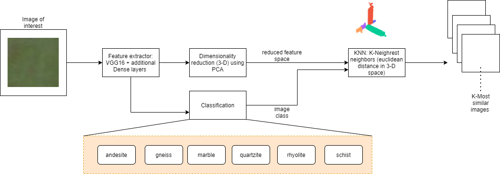

# Geological Similarity App

## Methodologie
This app allows geologist to find the K-Most similar images to an input image, the main steps of this pipeline are depicted in the following schema:

The previous pipeline is presented as a user freindly web app: 

Additional improvements will be taken into consideration in future updates:
- Fixing some prediction issues and improving the pipeline.
- Creating a docker image to assure reproducibility.
- Deploying the app to the cloud.

## Sources:
- The dataSet was taken from kaggle: 
[DataSet](https://www.kaggle.com/tanyadayanand/geological-image-similarity)

